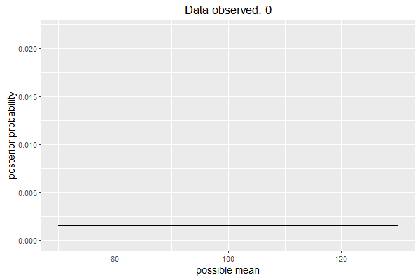
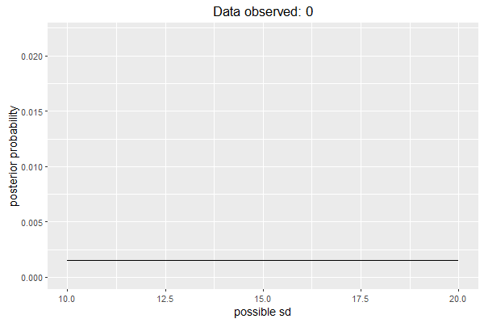
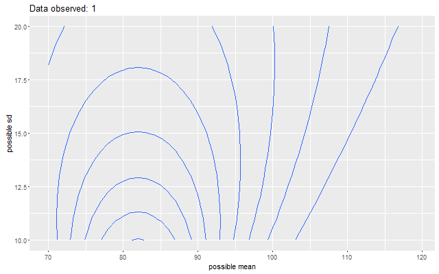

```{r setup, include=FALSE}
knitr::opts_chunk$set(
  echo = TRUE, 
  comment = "#>",
  collapse = TRUE)
```


```{r}
library("dplyr")
library("tidyr")
library("ggplot2")

# We have IQ some scores
iqs <- car::Burt$IQbio
iqs

# Want to use Bayesian updating to estimate the mean of the data and the sd of
# the data.

# Use a uniform prior across a range of means and SDs
each_mean <- seq(from = 70, to = 130, by = 1)
each_sd <- 10:20
# equal probability
p_mean <- 1 / length(each_mean)
p_sd <- 1 / length(each_sd)

# We are using a grid approximation. Create every combination of mean and sd.
# Joint probability as product of each one's prior probability.
df <- data_frame(each_mean, p_mean) %>%
  expand(nesting(each_mean, p_mean), nesting(each_sd, p_sd)) %>%
  mutate(prior = p_sd * p_mean,
         posterior = prior,
         data_seen = 0)
df

# Update the posterior given some data
update_distribution <- function(df, data) {
  data_seen <- unique(df$data_seen) + length(data)
  
  df %>%
    # Last posterior is current prior
    select(each_mean, each_sd, prior = posterior) %>%
    # Attach data to each mean-sd pair
    expand(nesting(each_mean, each_sd, prior), points = data) %>%
    # Measure likelihood of data in each mean-sd pair
    group_by(each_mean, each_sd, prior) %>%
    summarise(likelihood = prod(dnorm(points, each_mean, each_sd))) %>%
    ungroup %>%
    # bayes theorem
    mutate(posterior = likelihood * prior / (sum(likelihood * prior)),
           data_seen = data_seen)
}

# Create each sequence of data samples
iq_sequence <- Map(seq, 1, seq_along(iqs)) %>%
  lapply(function(xs) iqs[xs]) %>%
  purrr::map(~ update_distribution(df, .x))

# include 0 data seen
iq_sequence <- c(list(df), iq_sequence)

iq_sequence %>% 
  purrr::map_dbl(~ sum(.x$posterior))

df_fit <- iq_sequence %>%
  purrr::accumulate(bind_rows) %>%
  # Create animation steps
  purrr::map(. %>% mutate(step = max(data_seen)) %>%
               # Keep last five data_seen values.
               filter(step - data_seen <= 5) %>%
               # Create a column to control transparency using recency
               mutate(alpha = 1 - ((step - data_seen) / 5))) %>%
  bind_rows
df_fit

library("gganimate")

# plot posterior of means, one line per sd level
p <- ggplot(df_fit) +
  aes(x = each_mean, y = posterior, frame = step) +
  geom_line(aes(group = interaction(each_sd, data_seen), alpha = alpha)) +
  ggtitle("Data observed:") +
  xlab("possible mean") +
  ylab("posterior probability") +
  guides(alpha = FALSE) +
  theme_grey(base_size = 14)
animation::ani.options(interval = 1/10)
g <- gg_animate(p,  ani.height = 400, ani.width = 600)
# g
gg_animate_save(g, filename = "./updating.gif", saver = "gif",
                ani.height = 400, ani.width = 600)


# plot posterior of sds, one line per mean level
p <- ggplot(df_fit) +
  aes(x = each_sd, y = posterior, frame = step) +
  geom_line(aes(group = interaction(each_mean, data_seen), alpha = alpha)) +
  ggtitle("Data observed:") +
  xlab("possible sd") +
  ylab("posterior probability") +
  guides(alpha = FALSE) +
  theme_grey(base_size = 14)

g2 <- gg_animate(p,  ani.height = 400, ani.width = 600)

gg_animate_save(g2, filename = "./updating_sds.gif", saver = "gif",
                ani.height = 400, ani.width = 600)

p <- iq_sequence %>%
  bind_rows %>% 
  ggplot(.) +
  aes(x = each_mean, y = each_sd, z = posterior, group = data_seen, frame = data_seen) + 
  geom_contour() + 
  ggtitle("Data observed:") +
  xlab("possible mean") +
  ylab("possible sd")
g3 <- gg_animate(p, ani.height = 400, ani.width = 600)

gg_animate_save(g3, filename = "./updating_contour.gif", saver = "gif",
                ani.height = 400, ani.width = 600)
```






